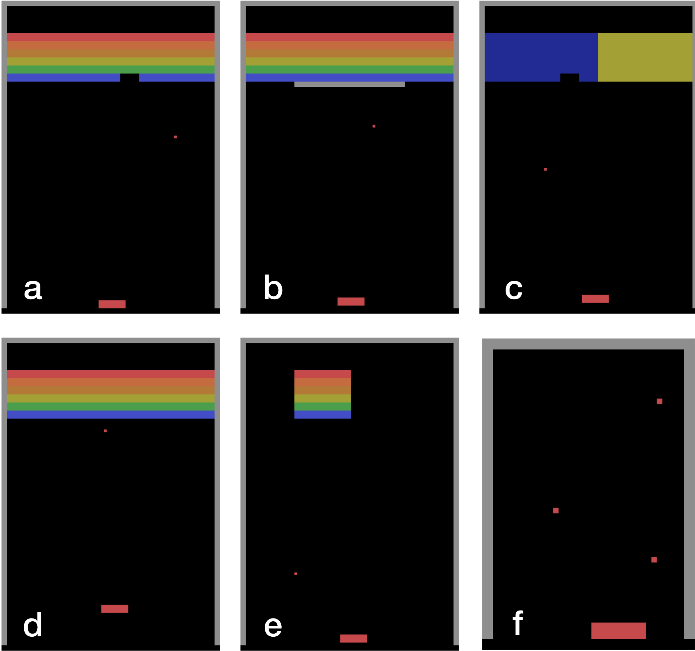

## Breakout Environments from Schema Network ICML '17 Paper

Adapted the original [repository](https://github.com/vicariousinc/schema-games) to have a working solution for Python3.

This repository contains the Breakout environments used to evaluate Schema Networks against A3C and Progressive Networks, as described in [our ICML '17 paper](https://www.vicarious.com/img/icml2017-schemas.pdf).

## How to play

Clone the repository:

```
git clone https://github.com/vicariousinc/schema_games.git schema_games
```

Install (setting up a virtual environment beforehand is recommended):

```
cd schema_games
pip install -r requirements.txt
```

You may then play games in interactive mode:

```
python schema_games/breakout/play.py StandardBreakout
python schema_games/breakout/play.py MiddleWallBreakout
python schema_games/breakout/play.py HalfNegativeBreakout
python schema_games/breakout/play.py OffsetPaddleBreakout
python schema_games/breakout/play.py RandomTargetBreakout
python schema_games/breakout/play.py JugglingBreakout
python schema_games/breakout/play.py MovingObstaclesBreakout
```

## Breakout Variations


### a) Standard Breakout

Control the paddle to move left and right. Get points when the ball hits a brick. Lose points when the ball goes below the paddle.

```
python schema_games/breakout/play.py StandardBreakout
```

### b) Middle Wall Breakout

When the ball hits the wall in the middle, it rebounds. To hit bricks, the wall must be avoided.

```
python schema_games/breakout/play.py MiddleWallBreakout
```

### c) Half Negative Breakout

The yellow bricks give negative points when struck by the ball.

```
python schema_games/breakout/play.py HalfNegativeBreakout
```

### d) Offset Paddle Breakout

The paddle is slightly raised with respect to the standard version.

```
python schema_games/breakout/play.py OffsetPaddleBreakout
```

### e) Random Target Breakout

The block of bricks randomly moves every time it is struck by the ball.

```
python schema_games/breakout/play.py RandomTargetBreakout
```

### f) Juggling Breakout

There are three balls and no bricks. The maximum possible score is zero.

```
python schema_games/breakout/play.py JugglingBreakout
```

## References
- [Blog post: General Game Playing with Schema Networks](https://www.vicarious.com/general-game-playing-with-schema-networks.html)
- [Paper: Kansky, Silver, Mély, Eldawy, Lázaro-Gredilla, Lou, Dorfman, Sidor, Phoenix and George. 2017.](https://www.vicarious.com/img/icml2017-schemas.pdf)
